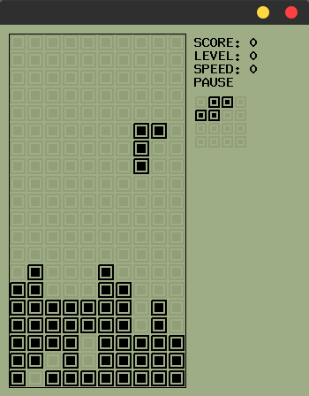
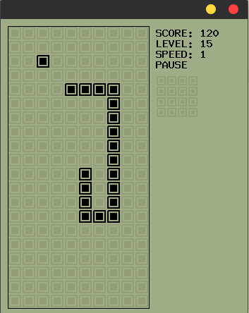
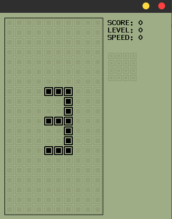
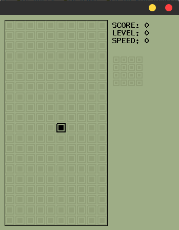

## Эмулятор BRICKGAME на язке С
### сейчас в нем 2 игры, тетрис и змейка, но есть возможность добавлять собственные
 

### Компиляция
для компиляции нужна библиотека [Xlib](https://www.x.org/docs/X11/)
и запустить программу make

### Управление
+ Enter - старт\пауза
+ Клавиши - стрелок вверх, вниз, право, влево

### Добавление новой игры
в папке **games** создать заголовочный файл для игры например **example_game.h**
в нем должно быть 4 внешних функции:
+ инициализация игры: **extern void exmaple_game_init();**
+ деструктор игры: **extern void example_game_destr();**
+ главный цикл игры: **extern void example_game_main_loop(unsigned long elapsed_ms);**
+ обработчик нажатия клавиш: **extern void example_game_on_key_pressed(int key_code);**
```c
#ifndef __EXAMPLE_GAME_H__
#define __EXAMPLE_GAME_H__

#include "../brickgame.h"

/* эта функция будет вызывана один раз при начале игры
 */
extern void exmaple_game_init();

/* эта функция будет вызывана в конце игры
 * в ней можно очистить динамическую память
 */
extern void example_game_destr();

/* эта функция будет вызыватся каждые 40 мс.
 *  elapsed_ms : кол-во миллисекунд прощедщих с начала запуска игры
 */
extern void example_game_main_loop(unsigned long elapsed_ms);

/* эта функция будет взывана при нажатии клавиши
 *  key_code : код нажатой клавиши, одно из значений
 *  KEY_CODE_UP, KEY_CODE_DOWN, KEY_CODE_LEFT, KEY_CODE_RIGHT, KEY_CODE_ENTER
 */
extern void example_game_on_key_pressed(int key_code);

#endif
```
реализация функций, файл: **example_game.c**
в примере игры по центру рисуется квадрат, который перемещается при нажатии клавиш стрелок

```c
#include "example_game.h"

// координаты квадрата
static int x, y;

/* эта функция будет вызывана один раз при начале игры
 */
void example_game_init() {
  /* bg_brick двумерный массив игрового поля 10x20 клеток
   *  записвая в него значения CELL_TYPE_FILLED CELL_TYPE_BLINK CELL_TYPE_EMPTY
   *  можно управлять отображением каждой из 200 ячеек
   */

  // первоначальные координаты квадрата будут x=5 y=10
  x = 5;
  y = 10;

  // закрасим ячейку с координатами x=5 y=10
  // если использовать значение CELL_TYPE_BLINK ячейка будет мигать
  bg_bricks[x][y] = CELL_TYPE_FILLED;
}

/* эта функция будет вызывана в конце игры
 * в ней можно очистить динамическую память
 */
void example_game_destr() {
  // в простейщей игре динамическая память не выделялась, тут делать нечего
}

/* эта функция будет вызыватся каждые 40 мс.
 *  elapsed_ms : кол-во миллисекунд прощедщих с начала запуска игры
 */
void example_game_main_loop(unsigned long elapsed_ms) {
  // эта процедура используется когда надо что-то двигать автаматически с некой
  // скоростью например падение фигуры в тетрисе или постоянное перемещение
  // змейки, в постейщем примере функция не используется
}

/* эта функция будет взывана при нажатии клавиши
 *  key_code : код нажатой клавиши, одно из значений
 *  KEY_CODE_UP, KEY_CODE_DOWN, KEY_CODE_LEFT, KEY_CODE_RIGHT, KEY_CODE_ENTER
 */
void example_game_on_key_pressed(int key_code) {
  /* в зависимости от нажатой кнопки увеличиваем или уменьшаем значение
   * координат x и y для упрощения нет проверки на выход за рамки игрового поля
   */
  int new_x = x;
  int new_y = y;

  switch (key_code) {
    case KEY_CODE_UP: {
      new_y -= 1;
      break;
    }
    case KEY_CODE_DOWN: {
      new_y += 1;
      break;
    }
    case KEY_CODE_LEFT: {
      new_x -= 1;
      break;
    }
    case KEY_CODE_RIGHT: {
      new_x += 1;
      break;
    }
  }

  // очистим старую ячейку
  bg_bricks[x][y] = CELL_TYPE_EMPTY;

  // установим новую, так клетка переместится на новые координаты
  x = new_x;
  y = new_y;
  bg_bricks[x][y] = CELL_TYPE_FILLED;
}
```
подключаем игру в файле **launcher.c** новая игра будет под номером 3
```c
 bg_add_game(&example_game_init, &example_game_destr, &example_game_main_loop, &example_game_on_key_pressed);

```
```c
#include "brickgame.h"
#include "games/snake.h"
#include "games/tetris.h"
#include "games/example_game.h"

int main() {
  /* добавляем игры */

  /* игра змейка */
  bg_add_game(&snake_init, &snake_destr, &snake_main_loop,
              &snake_on_key_pressed);

  /* игра тетрис */
  bg_add_game(&tg_init, &tg_destr, &tg_game, &tg_on_key_pressed);

  /* пример игры для демонстрации */
  bg_add_game(&example_game_init, &example_game_destr, &example_game_main_loop,
              &example_game_on_key_pressed);

  /* открываем окно */
  bg_init();

  return 0;
}
```
 


